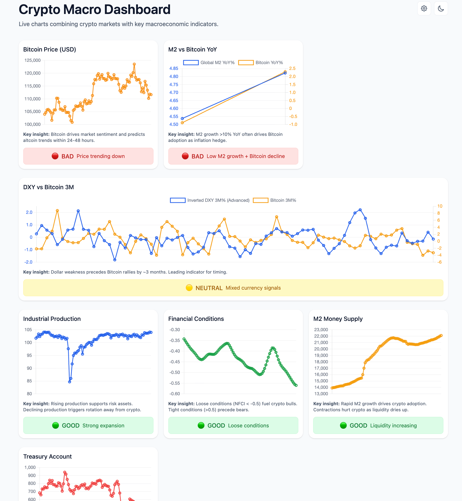

# Crypto Macro Dashboard

A professional trading dashboard combining Bitcoin price action with key macroeconomic indicators for informed crypto investment decisions.

## 🚀 Live Demo

**[View Dashboard](https://saga-labs.github.io/macro-crypto-dashboard/)**

## Screenshot



## Features

- **Real-time Bitcoin Price** - Live data from multiple crypto APIs
- **Macro Correlations** - M2 money supply vs Bitcoin YoY performance
- **Leading Indicators** - Inverted DXY 3-month advance signals
- **Economic Data** - PMI, NFCI, M2, and Treasury General Account
- **Smart Sentiment** - 🟢🟡🔴 indicators for crypto market conditions
- **Dark/Light Themes** - Professional UI with theme persistence
- **Mobile Responsive** - Works perfectly on all devices

## Key Insights

- **M2 Growth > 10%** → Often drives Bitcoin adoption
- **Dollar Weakness** → Precedes Bitcoin rallies by ~3 months  
- **PMI > 52** → Supports risk assets like crypto
- **NFCI < -0.5** → Loose conditions fuel crypto bull markets
- **TGA Drawdowns** → Inject liquidity, boosting crypto prices

## Tech Stack

- Pure HTML/CSS/JavaScript
- Chart.js for visualizations
- Tailwind CSS for styling
- Real-time APIs: CoinGecko, Binance, FRED

## Quick Start

```bash
# Clone the repo
git clone https://github.com/Saga-Labs/macro-crypto-dashboard.git

# Open in browser
open index.html
```

## License

MIT License